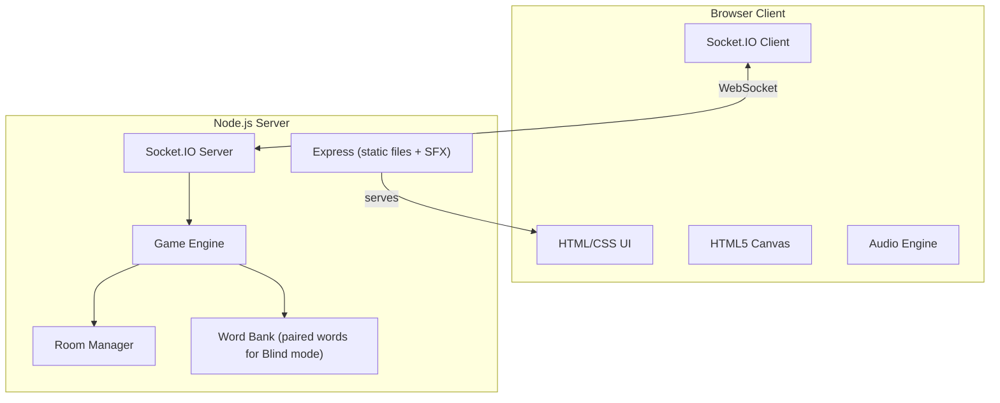
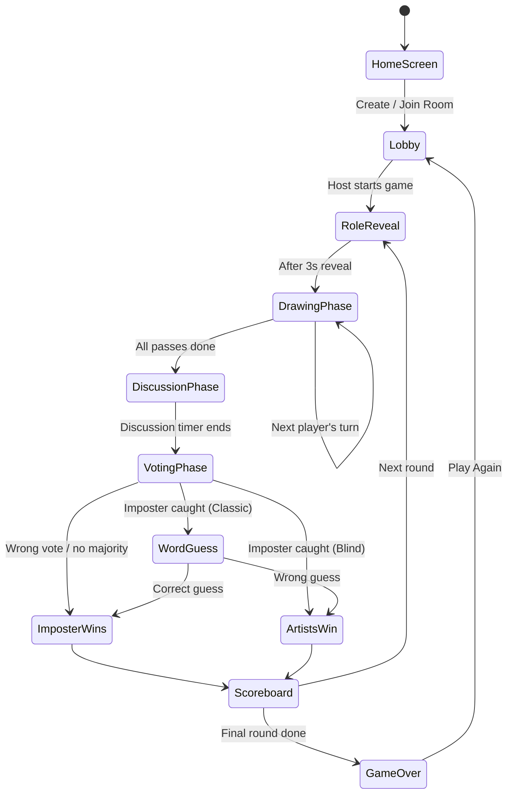

# Draw Mafia — Browser-Based Social Deduction Drawing Game

A multiplayer browser game that fuses **Skribbl.io-style progressive drawing** with **Mafia/Among Us social deduction**. Players collectively draw hints toward a secret word — but one among them is the **Imposter**, who doesn't know the word and must fake it.

---

## Game Modes

### 🎭 Classic Mode (Default)
- The imposter **knows** they are the imposter
- They receive **no word** and must bluff by observing others' drawings
- After drawing rounds, players vote on who they think the imposter is
- If caught, the imposter gets one chance to **guess the word** to steal a win

### 🔮 Blind Imposter Mode (New!)
- The imposter **does NOT know** they are the imposter
- They receive a **different word** from the same category (e.g., artists get "Guitar", imposter gets "Violin")
- Everyone draws genuinely believing they have the correct word
- Deduction shifts from "who's faking it?" to "whose drawing doesn't quite match?"
- After voting, the imposter is revealed — if they were caught, they learn they had the wrong word
- No word-guess lifeline in this mode (the imposter never knew they were bluffing)

> [!TIP]
> Blind Imposter mode works best when the two words are in the **same category but visually distinct enough** to notice differences. The word bank will include paired words for this mode (e.g., "Cat/Dog", "Piano/Guitar", "Pizza/Burger").

---

## Core Game Loop

1. **Lobby Phase** — Host creates a room, players join via room code. Host configures settings and starts the game.
2. **Role Assignment** —
   - *Classic*: Imposter(s) shown "You are the Imposter!" with no word. Artists shown the word.
   - *Blind Imposter*: Everyone shown "The word is: ____" — imposter gets a different word, no one knows who the imposter is (not even the imposter).
3. **Drawing Phase (Progressive)** — Players take turns drawing on a **shared canvas**. Each player gets a short time window to add a small contribution. The canvas is persistent across turns.
4. **Discussion Phase** — Canvas is locked. Chat-based discussion opens. Players debate who seems off.
5. **Voting Phase** — All players vote on who they think the imposter is.
6. **Resolution** —
   - *Classic*: If imposter caught → they guess the word. Correct guess = imposter wins. Wrong = artists win. If wrong player voted out → imposter wins.
   - *Blind Imposter*: If imposter caught → artists win. If wrong player voted out → imposter wins. The real imposter and both words are revealed.
7. **Scoreboard & Next Round** — Points are awarded. New round begins with fresh roles.

---

## Tech Stack

| Layer | Technology | Rationale |
|---|---|---|
| **Backend** | Node.js + Express + Socket.IO | Real-time bidirectional communication for multiplayer |
| **Frontend** | Vanilla HTML/CSS/JS + HTML5 Canvas | Zero build step, no framework overhead |
| **Audio** | Web Audio API + free SFX | Generated tones + bundled sound files |
| **Data Store** | In-memory (JS objects) | Rooms are ephemeral, no database needed |
| **Deployment** | Local / free-tier (Render, Glitch) | $0 cost |

---

## Architecture



---

## Proposed Changes

### Server Core

#### [NEW] [package.json](file:///c:/Users/aafaq/OneDrive/Desktop/Projects/draw-mafia/package.json)
- Project metadata, scripts (`npm start`, `npm run dev`)
- Dependencies: `express`, `socket.io`
- Dev dependency: `nodemon`

#### [NEW] [server.js](file:///c:/Users/aafaq/OneDrive/Desktop/Projects/draw-mafia/server.js)
- Express app serving static files from `/public`
- Socket.IO server attached to HTTP server
- Imports and wires up all server modules

---

#### [NEW] [src/RoomManager.js](file:///c:/Users/aafaq/OneDrive/Desktop/Projects/draw-mafia/src/RoomManager.js)
- `createRoom(hostId, hostName, settings)` → 6-char room code
- `joinRoom(roomCode, playerId, playerName)` → adds player
- `leaveRoom(roomCode, playerId)` → handles disconnects + host migration
- `getRoomState(roomCode)` → sanitized state for clients
- `updateSettings(roomCode, hostId, settings)` → host updates settings
- `kickPlayer(roomCode, hostId, targetId)` → host kicks a player
- In-memory `Map<roomCode, Room>` with auto-cleanup

#### [NEW] [src/GameEngine.js](file:///c:/Users/aafaq/OneDrive/Desktop/Projects/draw-mafia/src/GameEngine.js)
- `startGame(room)` — assigns roles based on game mode:
  - *Classic*: imposter(s) get no word, artists get the word
  - *Blind Imposter*: imposter(s) get a related-but-different word, artists get the main word
- `startDrawingPhase(room)` — manages turn order, timers, drawing passes
- `handleDraw(room, playerId, drawData)` — validates turn, broadcasts strokes (live or batched per settings)
- `startDiscussionPhase(room)` — opens chat, starts timer
- `handleVote(room, playerId, targetId)` — records vote
- `resolveVote(room)` — determines outcome based on game mode
- `handleWordGuess(room, playerId, guess)` — Classic mode only, imposter's last chance
- `nextRound(room)` — resets canvas, reassigns roles
- `calculateScores(room, result)` — mode-aware scoring

#### [NEW] [src/WordBank.js](file:///c:/Users/aafaq/OneDrive/Desktop/Projects/draw-mafia/src/WordBank.js)
- Loads words from JSON
- `getRandomWord(category?)` — for Classic mode
- `getWordPair(category?)` — for Blind Imposter mode, returns `{artistWord, imposterWord}` from same category
- Tracks used words per game session to avoid repeats

#### [NEW] [src/words.json](file:///c:/Users/aafaq/OneDrive/Desktop/Projects/draw-mafia/src/words.json)
- Categorized word lists for Classic mode (200+ words)
- **Paired words** for Blind Imposter mode — same category, visually distinct:
  ```
  Animals: ["Cat", "Dog"], ["Eagle", "Penguin"], ["Shark", "Whale"]
  Food:    ["Pizza", "Burger"], ["Cake", "Donut"], ["Sushi", "Taco"]
  Objects: ["Guitar", "Violin"], ["Chair", "Throne"], ["Sword", "Axe"]
  Places:  ["Beach", "Mountain"], ["Castle", "Lighthouse"], ["Forest", "Jungle"]
  Actions: ["Swimming", "Diving"], ["Dancing", "Running"], ["Flying", "Falling"]
  ```

#### [NEW] [src/SocketHandler.js](file:///c:/Users/aafaq/OneDrive/Desktop/Projects/draw-mafia/src/SocketHandler.js)
- Maps all Socket.IO events to RoomManager/GameEngine methods
- Events: `create-room`, `join-room`, `leave-room`, `start-game`, `draw`, `chat-message`, `cast-vote`, `guess-word`, `update-settings`, `kick-player`
- Handles connection/disconnection lifecycle

---

### Client

#### [NEW] [public/index.html](file:///c:/Users/aafaq/OneDrive/Desktop/Projects/draw-mafia/public/index.html)
- Single-page app with screen sections (home, lobby, game, results)
- HTML5 Canvas element for drawing
- Chat panel, player list, voting cards, drawing tools
- Audio elements for SFX

#### [NEW] [public/css/style.css](file:///c:/Users/aafaq/OneDrive/Desktop/Projects/draw-mafia/public/css/style.css)
- **Dark theme** with neon accent palette (cyberpunk/detective aesthetic)
- Glassmorphism panels with subtle backdrop-blur
- Smooth screen transitions and micro-animations
- Canvas and drawing tools styling
- Responsive layout (desktop + tablet)
- Role reveal animations (dramatic glow effects)
- Voting card hover effects
- Timer bar animation

#### [NEW] [public/js/app.js](file:///c:/Users/aafaq/OneDrive/Desktop/Projects/draw-mafia/public/js/app.js)
- Main controller: screen management, socket connection, game state
- Event listeners for all UI interactions
- Socket.IO event handlers for incoming game updates
- Phase transitions with animations

#### [NEW] [public/js/canvas.js](file:///c:/Users/aafaq/OneDrive/Desktop/Projects/draw-mafia/public/js/canvas.js)
- HTML5 Canvas drawing engine
- Tools: pen, eraser
- Color palette (preset colors + custom picker)
- Brush size slider
- Stroke capture as `{points[], color, size, playerId}`
- Live stroke broadcasting OR batch reveal (based on host setting)
- Replay incoming strokes from other players
- Undo last stroke (own strokes only, current turn)
- Canvas lock/unlock based on turn

#### [NEW] [public/js/ui.js](file:///c:/Users/aafaq/OneDrive/Desktop/Projects/draw-mafia/public/js/ui.js)
- DOM manipulation helpers
- Player list with turn/role indicators
- Chat message rendering
- Voting UI with player cards
- Timer display (circular countdown)
- Toast notifications
- Settings panel rendering

#### [NEW] [public/js/audio.js](file:///c:/Users/aafaq/OneDrive/Desktop/Projects/draw-mafia/public/js/audio.js)
- Web Audio API sound engine
- Synthesized sound effects (no external files needed):
  - **Tick** — timer countdown
  - **Ding** — turn start
  - **Whoosh** — phase transition
  - **Reveal sting** — role reveal (dramatic chord)
  - **Vote drum** — during voting
  - **Win fanfare / Lose buzzer** — round end
- Volume control + mute toggle
- All sounds generated procedurally via Web Audio API oscillators and noise — zero file downloads

---

## Room & Game Settings (Host-Configurable)

| Setting | Default | Range | Notes |
|---|---|---|---|
| **Game Mode** | Classic | Classic / Blind Imposter | Core mode toggle |
| **Max Players** | 8 | 3–12 | Minimum 3 for playability |
| **Draw Time (per turn)** | 15s | 5–30s | |
| **Drawing Passes** | 2 | 1–3 | How many times each player draws |
| **Drawing Visibility** | Live | Live / Reveal After Turn | Live = see strokes in real-time; Reveal = canvas updates after turn ends |
| **Discussion Time** | 60s | 30–120s | |
| **Voting Time** | 30s | 15–60s | |
| **Number of Rounds** | 3 | 1–10 | |
| **Word Category** | All | All / Animals / Food / Objects / Places / Actions | |
| **Number of Imposters** | 1 | 1–2 | 2 only available with 6+ players |

---

## Scoring System

| Event | Points | Mode |
|---|---|---|
| Imposter caught (each artist receives) | +100 | Both |
| Imposter guesses word correctly (after being caught) | +200 (imposter), artists get 0 for catch | Classic only |
| Imposter survives vote | +150 (imposter) | Both |
| Non-imposter wrongly voted out | -50 (voters who chose wrong) | Both |
| Blind Imposter caught | +120 (each artist) | Blind only |
| Blind Imposter — bonus for being unsuspected | +180 (imposter) | Blind only |

---

## UI Flow



### Screen Breakdown

1. **Home Screen** — Game logo with animated neon glow, "Create Room" button, "Join Room" input (room code), player name input, ambient particle background
2. **Lobby** — Player list (avatars with colored borders), copyable room code, settings panel (host only), chat sidebar, "Start Game" button (host only, disabled if < 3 players)
3. **Role Reveal** — Dramatic cinematic reveal:
   - *Classic*: "You are an **Artist**! The word is: `GUITAR`" OR "You are the **Imposter**! Observe and blend in."
   - *Blind Imposter*: "The word is: `GUITAR`" (everyone sees this — imposter sees their different word, unaware it's different)
4. **Drawing Phase** — Large canvas (center), player list with active turn highlighted, drawing tools (bottom bar), countdown timer (top), mini chat (side)
5. **Discussion Phase** — Canvas visible but locked, large chat panel, countdown timer, "Who seems suspicious?" prompt
6. **Voting Phase** — Player cards in a grid — click to vote, timer bar, "Skip Vote" option
7. **Word Guess** — *(Classic mode, imposter caught only)* Text input with dramatic timer for imposter to guess the word
8. **Round Results** — Reveal: who was the imposter, what the words were (both words in Blind mode), points animation
9. **Game Over / Scoreboard** — Final standings with rank badges, "Play Again" / "Back to Lobby" buttons

---

## Verification Plan

### Manual Verification
- Open 3+ browser tabs to simulate multiplayer
- Test complete game flow in both Classic and Blind Imposter modes
- Verify drawing canvas sync across all clients (both Live and Reveal modes)
- Test edge cases: disconnect mid-game, host leaving, voting ties, minimum 3 players
- Test with 2 imposters in a 6+ player lobby
- Verify audio plays correctly and mute toggle works
- Test responsive layout on different screen sizes

### Build Verification
```bash
npm start
```
- Server starts without errors on port 3000
- Static files served correctly
- Socket.IO connections established
